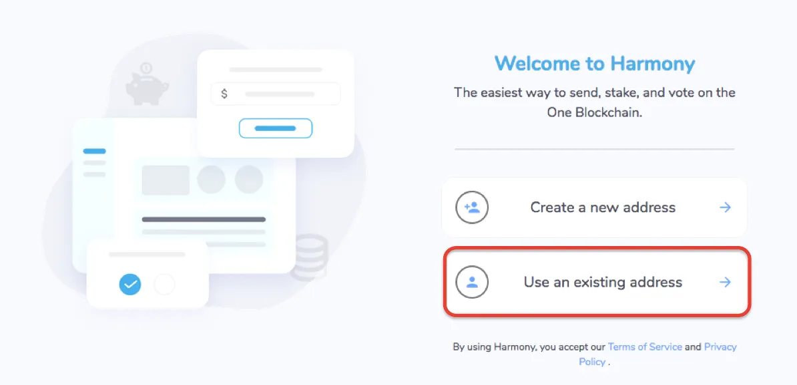

# Ethereum Staking (ETH via JinOro)

## Abstract

Introducing a new public service for Ethereum holders that are opened to staking to secure Ethereum further while earning protocol rewards. JinOro aims to be a compliant self-custody option to help gain adoption of Ethereum and crypto in general as a store of value with the potential to hedge against inflation, while having exposure to crypto as an alternative digital asset holding. JinOro is a project incubated by the KysenPool team with the support of former core members of Layer 1 protocols, cybersecurity firms, Silicon Valley tech engineers, former DeFi developers and wallet researchers on the Ethereum protocol.

<figure><figcaption>
Courtesy of <a href="https://jinoro.xyz">JinOro.xyz</a>
</figcaption></figure>

## How It Works

JinOro has simplified staking, by creating a flow and simplying the otherwise cumbersome mechanisms of staking (generating validator keys, running server nodes, installing software, liveness checking, creating payloads to then sign with, etc.) **into 3 easy steps**.&#x20;

1. To Solo Stake or join a Pool _(only Solo Stake is available at this time)_
2. Determining how Validators (32 ETH each) you’d like to stake with
3. Sign the Transaction to confirm staking natively

<figure><figcaption>
Courtesy of <a href="https://jinoro.xyz">JinOro.xyz</a>
</figcaption></figure>

## Types of Rewards for Ethereum Staking

There are three types of rewards

* **Consensus Layer rewards** — this is sent to you on a weekly basis for all the attestations that your validator has helped verify for every single block of transactions
* **Execution Layer rewards** — once it’s your validator to propose a block, the Ethereum protocol allows for all the transaction-related fees be sent to your validator as a reward for arranging the block according to&#x20;
* **Tips/MEV rewards** — Tips are rewarded based on performance or outperforming attestations on a consistent basis, while MEV (Maximally Extractable Value) rewards are arbitrage opportunities during a block proposals

## Depositing a Stake

This is an exciting venue to finally be able to put up your ETH to be deposited into the staking contract natively via [Safe Global](https://safe.global) (previously known as Gnosis Safe) and Metamask, optionally secured by a hardware wallet such as [Ledger](https://www.ledger.com/).

Staking on JinOro does NOT currently mint any new tokens. Your ETH is directly deposited into Beaconchain’s Deposit Contract (and not swapped to xxETH, a taxable event). Since your wallet is used to sign the deposit contract, then the Beaconchain recognizes that you are the depositor hence all protocol rewards (consensus and execution layer) are deposited directly into your wallet by Beaconchain on a weekly basis.

<figure><figcaption>
Courtesy of <a href="https://jinoro.xyz/staking">JinOro.xyz</a>
</figcaption></figure>

When diving deeper into this process, you’ll witness **JinOro in NOT an intermediary** for your funds _and_ has no ability to touch your rewards. As an operator to your validator, JinOro can only direct where your MEV rewards can be sent to. JinOro generates a new smart contract from a template to hold your Tip/MEV rewards, with a rule to split the rewards 75/25 between you (75%) and JinOro (25%) when you claim the reward.

<figure><figcaption>
Courtesy of <a href="https://jinoro.xyz/staking">JinOro.xyz</a> Staking
</figcaption></figure>

## Dashboard to Review your Staking Portfolio

Once staked, you will see a list of Validators that you have been staked by you via JinOro. You can verify this directly via Beaconchain, which is the “native staking layer” for Ethereum, as seen on the [beaconcha.in](https://beaconcha.in) website

Your rewards will begin accumulating over time, claimable at any time by signing the Claim smart contract when you use the “Collect All Rewards” call-to-action. This is when the 75% of rewards you can claim at your convenience once one of your validators propose at least a block. You can claim as often as you feel appropriate, or let it accumulate over time.

<figure><figcaption>
Courtesy of <a href="https://jinoro.xyz/dashboard">JinOro.xyz</a> Dashboard
</figcaption></figure>

If you happen to use multiple wallets to stake with JinOro, each will have its own dashboard, and you will notice that the smart contract address related to each claim is different. That’s because the Tip/MEV rewards are deposited into a **smart contract that is unique to each depositor wallets**. This creates a firewall between each depositor as it silos the risks associated to the collection of rewards, if in case the smart contract is compromised


The Tip/MEV rewards are deposited into a smart contract that is unique to each depositor wallets. This creates a firewall between each depositor as it silos the risks associated to the collection of rewards, if in case the smart contract is compromised


***

## Confirming Your Validator on Beaconchain

You can then easily confirm your validator via the call-to-action to Beaconchain for each of your validator. You can review how your validator has performed as compared to your other validators, or other validators in the entire Ethereum network, and the frequency of the consensus layer rewards that are deposited to your wallet.

<figure><figcaption>
Courtesy of <a href="https://goerli.beaconcha.in/validator/8164f97710128ea948eac89d834757ec4059e3e4b125516af3b03e1db01a8ff914e2f112d3e486ecd3dfb8301afa9f54">Beaconcha.in</a> (on the Goerli Testnet)
</figcaption></figure>

## Withdrawing your Staked Deposits

To exit a Validator (withdraw your 32 ETH), the process is simple and secure — you sign an offline message (no gas fee required) and send that payload to JinOro, which then confirms that the request is authentic, to then begin the withdrawal process. The messaging is clearly stated in the Exit Validator call-to-action on which Validator you have chosen to exit with, how long the process takes, and how to track the exit via Beaconchain

<figure><figcaption></figcaption></figure>

## Compatibility

Partnering with [Ankr](https://medium.com/u/750a7f07d9a9), [KysenPool](https://medium.com/u/f2cd4047058b) and [ssv.network Team](https://medium.com/u/7bfde6196328), JinOro is aiming to be a compliant and reputable staking service for Ethereum and other chains to come, while being compatible with the industry standard wallets starting with [Safe](https://safe.global), [MetaMask](https://metamask.io/), [WalletConnect](https://walletconnect.com/) and [Ledger](https://ledger.com) hardware wallet

<figure><figcaption></figcaption></figure>

***

## Ethereum Foundation Goals

The Ethereum Foundation (EF) encourages everyone that's capable of operating an Ethereum client be doing so and staking 32 ETH at a time on a self-operated (or so called "Solo-staking") validator.  The main goal is to secure the Ethereum network with as many home solo staking operators as possible, to help decentralize Ethereum's network to as far reaching as possible throughout the globe. &#x20;

The EF then introduced the [**Launchpad**](https://launchpad.ethereum.org) to assist solo-stakers to generate self-sovereign validator accounts (or keys) in order to begin the solo-staking process.  However, this wasn't enough to help fulfill the vision of the EF as professional operators and Web3 teams began to fill the gap.



<figure><figcaption>
Screenshot of Ethereum Foundation's Staking Launchapd
</figcaption></figure>

## Staking Economy Gaps

With the current staking requirement architecture, staking in Ethereum has become a challenge to those who:

* do not have at least 32 ETHs which they're willing to lock up as part of the staking requirements
* do not have the technical expertise (or possess the confidence) to run Ethereum nodes effectively
* do not wish to bear the responsibility of safekeeping validator keys nor maintaining Ethereum nodes over weeks or months at a time

Hence, there are numerous innovations to help bridge these gaps such as [Staking-as-a-Service (SaaS), Pooled Staking and Centralized Exchange](https://ethereum.org/en/staking/)-based staking.

## How KysenPool is Contributing to Staking on Ethereum

As an operator in Proof-of-Stake (PoS) chains since 2019, the KysenPool team noticed this gap as they were adding Ethereum PoS into their portfolio, and hence decided to incubate a project to develop a SaaS solution.  In Q3 2023, KysenPool launched a convenient 1-click staking service called [**JinOro**](https://jinoro.xyz)

***

## Summary

We hope this article introducing [**JinOro**](https://jinoro.xyz) has been helpful to clarify what JinOro is all about, why this service exists, how it works and who is backing JinOro’s service. There are several more long term partnerships lined up and the JinOro team to help sustain the staking architecture to continue to improve upon the platform features, reliability and security of this platform.
